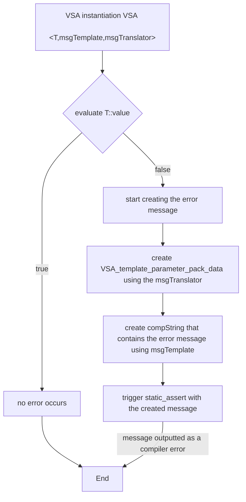

# Verbose Static Assert

The idea behind verbose static assert is to give the ability for programmers to create custom dynamic compile time error messages for their templated types.<br>
Having such error messages can be very useful for programmers that will be using the created types, allowing them to easily see what conditions lead to a compiler error.<br>
While it is mainly intended for metaprogramming, it can be used in any

## general overview

Verbose Static Assert is a wrapper type around static assert.<br>
Verbose Static Assert takes three types as template Arguments:<br>
verbose_static_assert\<typename T, template\<typename> typename msgTemplate, tempalte\<typename> typename msgTranslator><br>
Where typename T is a metaprogramming function that is being asserted.<br>
Where msgTemplate is an incomplete templated type that serves as the instructions to create an error message based on T.<br>
Where msgTranslator is an incomplete templated type that will transform the template parameters for T into a verbose_static_assertNS:: VSA_template_parameter_pack_data.<br>

Requirements for template parameters:<br>
- typename T must have a member value, of a type that can be implicitly converted to bool, named 'value'.<br>
- msgTemplate must have a member type name 'msg' that is a compString type containing the generated error message.<br> 
- msgTranslator must have a member type named 'type' that is a verbose_static_assertNS::VSA_template_parameter_pack_data constructed from T.<br>

### verbose static assert flow chart



### msgTranslator
The job of the message translator is to take the type T, extract its template parameters and type, and create a verbose_static_assertNS::VSA_template_parameter_pack_data based of the template parameters.<br>
VSA_template_parameter_pack_data\<typeList,containerT> requires two template parameters:
- typeList must be a verbose_static_assertNS::detail::mp_list, which contains the template parameters of T, any parameter that is a value must be converted to a type using the type verbose_static_assertNS::detail::valueAsType.<br>
- containerT is a the template type of T. As containerT is somewhat optional, as their is no generic way to pass a template template parameter, so containerT can be a the type T itself, or a complete type of the template T with specific parameters, or any other complete type, such as void. What containerT will be is dependent on the context of where the translator will be used.<br>


Inside the namespace verbose_static_assertNS there are two basic translators:<br>
- VSA_translate_with_only_types, for templates that have only types<br>
- VSA_translate_with_only_values, for templates that have only values<br>

The default translator is VSA_translate_with_only_types<br>

Example:<br>
Lets say we have a type MpFunc\<typename T, bool A, typename... Us>, and we want to create a translator for it.<br>

```cpp
//start with a base template that we will specialize
template<typename>
struct translaterT;

//create the specialization for the pattern of we want
template<template<typename,bool,typename...> typename container, typename T, bool A, typename... Us>
struct translaterT<container<T,A,Us...>>{
	//here we will create a mp_list of the template parameters
	using list = verbose_static_assertNS::detail::mp_list< T, verbose_static_assertNS::detail::valueAsType<A>, Us... >;
	// Note that we converted the value A into the wrapper type 'valueAsType'
	// and that all parameters in mp_list are in the same order as MpFunc
	
	//container type
	//here we pass the type container with some arbitrary parameters.
	using contT = container<void,0>;

	//create the final VSA_template_parameter_pack_data type
	using type = verbose_static_assertNS::VSA_template_parameter_pack_data<list,contT>;
};
```


### VSA_template_parameter_pack_data
The type verbose_static_assertNS:: VSA_template_parameter_pack_data provides an easy way to access the data of the template parameters.<br>
It contains the following member types and value:<br>
- size_t size - returns the amount of template parameters.<br>
- bool isType\<size_t i> - return wether the parameter at pos i is a type (i.e. wether the type is not a valueAsType type).<br>
- bool isValue\<size_t i> - returns wether the parameter at pos i is a value (i.e. wether the type is a valueAsType type).<br>
- typename typeAt\<size_t i> - returns the type at pos i, if the element at pos i turns out to not be a type, then an error occurs.<br>
- auto valueAt\<size_t i> - returns the value at pos i, if the element at pos i turns out to not be a value, then an error occurs.<br>
- typename typeStringAt\<size_t i> - returns the compString representation of typeAt<i>.<br>
- typename valueStringAt\<size_t i> - returns the compString representation of valueAt<i>.<br> 
- typename container - returns the type of T


### msgTemplate
A message template accepts VSA_template_parameter_pack_data as its parameter<br>
Then using the data from it, it will create a member type 'msg' that is a compString which contains the error msg.<br>

Example:<br>
Continuing our example from before. Lets say that for the type MpFunc\<typename T, bool A, typename... Us> we want to create an error message based on the following rules:<br>
- if bool A is true, then no types in Us can be the same as T, the indexes of the offending types will be outputted 
- if bool A is false, then no types in Us can be different from T, the indexes and names of the offending types will be outputted 

```cpp
//A helper type the will be called recursively to iterate over the types of Us and generate the error message
template<typename T, size_t i, typename msg>
// Here T is the VSA_template_parameter_pack_data, i is the index of the current tested type, and msg is the previous part of the message that we will append to
struct MpFunc_VSA_message_impl{
    static constexpr auto f(){
        // Here we will break recursion after we went through all the types
        if constexpr (T::size <= i){
            //went through all types, finish message,
            //depending on bool A appen an endline symbol to the end
            if constexpr(T::template valueAt<1> == 1){
                using retMsg = typename msg::template append<decltype("\n"_compStr)>;// adding "/n" to the end of message
                return retMsg{};
            }else{
                return msg{}; // returning message as is
            }
        }else{
            // testing type at i
            constexpr bool A = T::template valueAt<1>; // value of bool A
            using baseT = typename T::template typeAt<0>; // type T
            using otherT = typename T::template typeAt<i>; // type Us[i]
            // if A == true and T == Us[i], then upadate the message
            if constexpr(A&&std::is_same_v<baseT,otherT>){ 
                using addOnMessage = typename valueToCompString<i>::type::template append<decltype(", "_compStr)>; // string to add to message
                using retMsg = typename msg::template append<addOnMessage>; // appending 
                return typename MpFunc_VSA_message_impl<T,i+1,retMsg>::type{}; // recursive call, with the updated message
            }else
            // if A == false and T != Us[i], then update the message
            if constexpr((!A)&&(!std::is_same_v<baseT,otherT>)){
                using addOnMessage = typename decltype("the type '"_compStr)
                ::template append<typename T::template typeStringAt<i>>
                ::template append<decltype("' at pos: "_compStr)>
                ::template append<typename valueToCompString<i>::type>
                ::template append<decltype("\n"_compStr)>; // string to add to message
                using retMsg = typename msg::template append<addOnMessage>;
                return typename MpFunc_VSA_message_impl<T,i+1,retMsg>::type{};// recursive call, with the updated message
            }else{
                // no error state achived, so move on to the next type, with message unchanged 
                return typename MpFunc_VSA_message_impl<T,i+1,msg>::type{};// recursive call, with the mesage as is
            }
        }
    };
    using type = decltype(f()); // return type of f() is a compString containing the message
};

//the message template type
template<typename T>
struct MpFunc_VSA_message{
    // depending on bool A, the message will be began differently 
	static constexpr auto f(){
		if constexpr(T::template valueAt<1> == 1){
			using retMsg = typename decltype("\nfound types that are equal to the type '"_compStr)	
					::template append<typename T::template typeStringAt<0> >
					::template append<decltype("' at pos:\n"_compStr)>;
			return retMsg{}; // bool A == true
		}else{
			using retMsg = typename decltype("\nfound types that are differnt from the type '"_compStr)	
					::template append<typename T::template typeStringAt<0> >
					::template append<decltype("':\n"_compStr)>;
			return retMsg{}; // bool A == false
		}
	}
	
	using msg = typename MpFunc_VSA_message_impl<T,2,decltype(f())>::type; // call the recursive type MpFunc_VSA_message_impl to generate the error message
};
```

### VSA use example

Lets define the type MpFunc<br>
```cpp
template<typename T, bool A, typename... Us>
struct MpFunc{
	// here would be the evaluation of 'value' to true or false based on the template parameters 
	// for simplicity it is set to false, to always trigger the failure on the static assert
	static constexpr bool value = false; 
	// if 'value' were to be true, then no error would occur 
};
```


Now, if we call verbose static assert as such:<br>
```cpp
using for_VSA_a = MpFunc<int,1,bool,char,int,long int, double,int,int,char,int>;
verbose_static_assert<for_VSA_a, MpFunc_VSA_message, translaterT>{}; // instantiation of verbose_static_assert, effectively, calls static_assert
```
We will get the following compilation error:<br>
```cpp
...
error: static assertion failed: 
found types that are equal to the type 'int' at pos:
4, 7, 8, 10, 
...
```

Or if we call is with bool A set to false:<br>
```cpp
using for_VSA_b = MpFunc<int,0,bool,char,int,long int, double,int,int,char,int>;
verbose_static_assert<for_VSA_b,MpFunc_VSA_message,translaterT>{};
```
We will get the following compilation error:<br>
```cpp
...
error: static assertion failed: 
found types that are differnt from the type 'int':
the type 'bool' at pos: 2
the type 'char' at pos: 3
the type 'long int' at pos: 5
the type 'double' at pos: 6
the type 'char' at pos: 9
...
```


## steps of assertion
1. Upon the instantiation of verbose_static_assert, the value of T::value is evaluated.
2. If the value of T::value is true, then the instantiation of verbose_static_assert is finished, no compiler error occurs.
3. Else, the compString type msgTemplate<typename msgTranslater<T>::type>::msg is evaluated and the compiler error 'static assert failed' occurs with the generated compString as the message.


